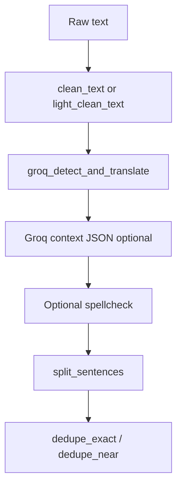

# voice_module

FastAPI backend for audio transcription and analysis.

## Run Backend

Install dependencies from `voice_module`, then start Uvicorn from the `app` folder (imports like `from transcribe import` expect the working directory to be `app`):

```bash
cd voice_module
pip install -r requirements.txt
cd app
python -m uvicorn main:app --reload --host 127.0.0.1 --port 8000
```

The API endpoint used by the frontend:

- `POST /voice/analyze` with `multipart/form-data` field `file`

## Data input layer (reviews ingestion)

Unified review records: `review_id`, `text`, `source`, `timestamp`, `product_id` (defaults to `unknown`).

| Method | Path | Description |
|--------|------|---------------|
| `POST` | `/upload/csv` | `multipart/form-data` field `file` — CSV with a `text` column (case-insensitive); optional `timestamp`, `product_id` |
| `POST` | `/upload/json` | `file` — JSON array of objects (or one object), each with `text` |
| `POST` | `/upload/manual` | `application/x-www-form-urlencoded` field `text` — one review per non-empty line |
| `POST` | `/upload/analyze-fakes` | JSON body: either `{"reviews": [<ReviewRecord>, ...]}` from a prior ingestion response, or `{"session_id": "<id>"}` to score normalized rows from that chunk session (capped by `FAKE_ANALYZE_MAX_ROWS`) |
| `POST` | `/upload/analyze-insights` | Same JSON shape as analyze-fakes: trends across two time windows, urgency index, bias-adjusted sentiment, recommendations (capped by `INSIGHTS_MAX_ROWS`) |
| `POST` | `/fetch/youtube` | JSON body `{"url": "<youtube url or video id>"}` — requires `YOUTUBE_API_KEY` |
| `WebSocket` | `/ws/review-stream` | Query: `session_id` (required), `interval_ms` (optional, 50–60000, default 1500). Replays all normalized reviews from that chunk session as JSON: `{"type":"review","review":{...}}`, then `{"type":"done","count":N}`. Use `ws://` or `wss://` on the same host/port as the HTTP API (the Vite app maps this from `VITE_API_BASE_URL`). |

YouTube: set environment variable `YOUTUBE_API_KEY` before calling `/fetch/youtube`.

Sample CSV: [samples/reviews_sample.csv](samples/reviews_sample.csv).

## Hybrid fake review detection

After preprocessing, `POST /upload/analyze-fakes` scores each review with **rules** (always on), optional **Hugging Face sequence classification** (RoBERTa or any `AutoModelForSequenceClassification` weights), and optional **sentence-transformer** batch similarity (near-duplicate / campaign signal). Scores are **fused** and compared to `FAKE_THRESHOLD`.

Environment variables (all optional unless noted):

| Variable | Default | Purpose |
|----------|---------|---------|
| `FAKE_THRESHOLD` | `0.6` | `fake_confidence` above this ⇒ `is_fake` |
| `FAKE_FUSION_W_ML` | `0.7` | Fusion weight for ML probability (normalized with rules when ML is on) |
| `FAKE_FUSION_W_RULES` | `0.3` | Fusion weight for rule score |
| `FAKE_SIMILARITY_BOOST` | `0.12` | Added to fused score when SBERT finds a neighbor above threshold |
| `FAKE_ANALYZE_MAX_ROWS` | `2000` | Max reviews when resolving from `session_id` or truncating inline `reviews` |
| `FAKE_DETECT_ENABLE_ML` | unset | Set to `1` to load HF classifier |
| `FAKE_ROBERTA_MODEL_ID` | `roberta-base` | Hugging Face model id (use your fine-tuned fake/real checkpoint in production) |
| `FAKE_ROBERTA_MAX_LENGTH` | `256` | Tokenizer max length |
| `FAKE_ROBERTA_BATCH_SIZE` | `8` | Inference batch size |
| `FAKE_DETECT_ENABLE_SBERT` | unset | Set to `1` to run batch similarity |
| `FAKE_SBERT_MODEL` | `sentence-transformers/all-MiniLM-L6-v2` | Embedding model |
| `FAKE_SBERT_SIM_THRESHOLD` | `0.92` | Cosine similarity threshold for `near_duplicate_campaign` |

## Review insights (`POST /upload/analyze-insights`)

Time-bucketed lexicon trends (packaging, delivery, quality, battery, price, service), TextBlob sentiment, optional fake-rate in the **current** window, weighted **urgency score** (0–100), Bayesian-shrunk **adjusted sentiment**, and **recommendations** (Groq JSON list when `GROQ_API_KEY` is set; else templates).

The response also includes **`aspect_sentiment`**: sentence-level splits of each review’s `text`, **lexicon** feature hits per sentence (same buckets as trends), and **TextBlob polarity** averaged per feature within each window (true aspect-style when each ingested row is one sentence; multi-aspect in one row still splits on sentence boundaries). Optional **Groq** can batch-refine aspect sentiments on the **current** window. Reviews with **`preprocess_ambiguous`** are skipped for ABSA when `INSIGHTS_ABSA_SKIP_AMBIGUOUS=1` (default); **`preprocess_sarcastic`** dampens polarity for those rows.

| Variable | Default | Purpose |
|----------|---------|---------|
| `INSIGHTS_MAX_ROWS` | `2000` | Max reviews per request (inline or from `session_id` resolution) |
| `INSIGHTS_WINDOW_SIZE` | `50` | Reviews per window (previous vs current), when enough rows exist |
| `INSIGHTS_ANOMALY_MODE` | `none` | `none`, `zscore` (across-feature z on \|delta\|), or `iforest` (2D prev/current rates) |
| `INSIGHTS_USE_FAKE` | unset | Set to `1` to blend fake-detection rate into urgency (extra work on current window) |
| `INSIGHTS_WEIGHT_NEG_SENTIMENT` | `0.4` | Urgency fusion weight |
| `INSIGHTS_WEIGHT_TREND` | `0.4` | Urgency fusion weight |
| `INSIGHTS_WEIGHT_FAKE` | `0.2` | Urgency fusion weight |
| `INSIGHTS_BIAS_STRENGTH` | `12` | Prior strength for sentiment shrinkage toward neutral |
| `INSIGHTS_MIN_VOLUME_FOR_FULL_WEIGHT` | `30` | Denominator cap for volume confidence |
| `INSIGHTS_ABSA_SKIP_AMBIGUOUS` | `1` | When `1`, reviews with `preprocess_ambiguous=true` do not contribute to `aspect_sentiment` |
| `INSIGHTS_ABSA_GROQ` | `0` | Set to `1` for one optional Groq JSON batch on the current window to refine aspect sentiment/confidence |
| `INSIGHTS_ABSA_GROQ_MAX_REVIEWS` | `12` | Max reviews sent in that batch (truncated text per row) |
| `INSIGHTS_ABSA_GROQ_MODEL` | falls back to `GROQ_MODEL` / default Groq model | Model id for the ABSA batch call |

## Preprocessing layer (ingestion pipeline)

All ingestion routes feed the same preprocessing pipeline in this strict order:



1. **Cleaning** — default: lowercase, URL/html removal, whitespace, emoji aliasing. Optional **`PREPROCESS_LIGHT_CLEAN=1`**: preserves casing; strips URLs and demojizes only (same emoji fallback as default when `emoji` is missing).
2. language detection (**langdetect** when installed) and English translation (**Groq only for non-English** text when `GROQ_API_KEY` is set; English skips Groq for speed)
3. **Optional Groq context** — when **`GROQ_CONTEXT_ENGINE=1`**, a structured JSON pass runs on the post-translation English string **before** spellcheck. When the model returns **`clean_text`**, that string is what spellcheck and sentence splitting run on, so each `ReviewRecord.text` reflects that normalization when present; otherwise the pipeline uses the translated text as today.
4. spell correction
5. sentence segmentation
6. exact + near-duplicate removal

### Groq (language + translation)

Set in `voice_module/.env` (or the process environment):

- `GROQ_API_KEY` — when set, **non-English** rows (per langdetect) use Groq for **translation to English** only. English text does **not** call Groq, which speeds up large English-only CSVs.
- `GROQ_MODEL` — optional; defaults to `llama-3.1-8b-instant` if unset.
- `GROQ_LANGDETECT_MIN_CHARS` — optional; default `18`. Shorter cleaned strings are treated as English without calling langdetect or Groq (avoids flaky detection on tiny snippets).
- `GROQ_SKIP_TRANSLATION_LANGS` — optional; comma-separated ISO 639-1 **base** codes that skip Groq (default `en`). Example: `en` or `en,de` if German should pass through untranslated.

### Groq context engine (nuance layer)

| Variable | Default | Purpose |
|----------|---------|---------|
| `GROQ_CONTEXT_ENGINE` | `0` | Set to `1` to enable a second Groq JSON pass (sentiment, sarcasm, ambiguity, interpreted meaning, confidence). **Off by default** so installs stay predictable. |
| `GROQ_CONTEXT_MODEL` | falls back to `GROQ_MODEL`, then `llama-3.1-8b-instant` | Model id for the context call only. |
| `PREPROCESS_LIGHT_CLEAN` | `0` | Set to `1` for URL strip + demoji only, **preserving casing** (default full `clean_text` unchanged). |

When enabled and Groq returns valid JSON, each sentence row carries optional metadata on **`ReviewRecord`**: `preprocess_sentiment`, `preprocess_sarcastic`, `preprocess_ambiguous`, `preprocess_meaning`, `preprocess_confidence` (0–1, blended with a simple length/punctuation clarity heuristic when the model supplies confidence). If the API key is missing or the call fails, those fields stay `null` and ingestion continues unchanged.

If **`langdetect` is not installed**, behavior matches the legacy path: a **single Groq call** per row does detection plus translation when Groq is configured.

If `GROQ_API_KEY` is missing or Groq errors, the pipeline uses **langdetect** for `detected_language` when available and **does not translate** (`translated` stays false). Ingestion remains synchronous; non-English rows still hit Groq rate limits when translating.

Output records include optional traceability metadata:

- `original_text`
- `detected_language`
- `translated`

Near-duplicate removal uses Sentence-BERT when available, with a safe string-similarity fallback.

### Tests

From `voice_module/app`:

```bash
python -m pytest tests/ -v
```

### Note on `helpers.py`

`app/utils.py` already exists for voice helpers. YouTube URL parsing lives in `app/helpers.py` to avoid a `utils/` package name clash with `utils.py`.

## React Frontend

A React app is available at `../frontend`.

From `frontend`:

```bash
npm install
npm run dev
```

Default frontend URL is `http://localhost:5173`.
Backend CORS is configured to allow this origin.

## Optional Frontend API Base URL

Set `VITE_API_BASE_URL` in a `.env` file under `frontend` if your backend runs on a different host/port:

```bash
VITE_API_BASE_URL=http://localhost:8000
```

## Structure

- `app/main.py` - FastAPI entry point
- `app/routes/upload.py` - CSV / JSON / manual upload routes
- `app/routes/youtube.py` - YouTube comments route
- `app/services/parser.py` - Parse uploads to DataFrames
- `app/services/groq_lang.py` - Groq JSON language detection + translation
- `app/services/normalizer.py` - Clean + normalize to unified schema
- `app/services/youtube_service.py` - YouTube Data API client
- `app/models/schema.py` - Pydantic models for ingestion responses
- `app/helpers.py` - YouTube video id extraction
- `app/transcribe.py` - Whisper transcription
- `app/llm_engine.py` - LLM-based analysis
- `app/utils.py` - Helpers (including audio conversion)

